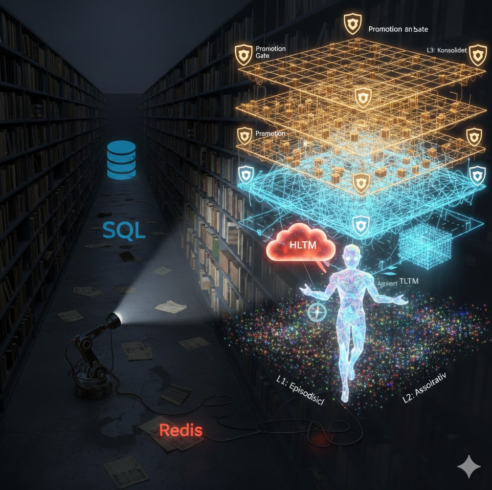

# Agent Sapiens

**Eine neue Art, wie KI sich erinnert.**

<p align="center">
  
</p>

---

## Worum geht es hier?

Stell dir vor, du redest jeden Tag mit einer KI. Du erzählst ihr, dass du Python liebst, dass du Tabs statt Spaces bevorzugst, dass du Horror-Filme eigentlich nicht magst – außer *Hereditary*, der war großartig. Du erklärst ihr dreimal, wie dein Projekt aufgebaut ist. Und beim vierten Mal? Fragt sie wieder von vorne.

Das ist der Zustand heute. KI-Systeme haben kein echtes Gedächtnis. Sie haben ein Kontextfenster – einen schmalen Lichtkegel wie eine Taschenlampe in einem dunklen Raum. Was außerhalb liegt, existiert nicht. Jede Konversation beginnt bei null.

**Agent Sapiens ist der Versuch, das zu ändern.**

Nicht durch größere Datenbanken. Nicht durch längere Kontextfenster. Sondern durch eine Architektur, die dem nachempfunden ist, wie Gedächtnis tatsächlich funktioniert: als formbares, lebendiges System, das lernt, vergisst, sortiert und reift.

---

## Der Gedankengang

Die Idee hinter Agent Sapiens entstand aus einer einfachen Beobachtung: **Menschen erinnern sich nicht an alles – und genau das macht ihr Gedächtnis so leistungsfähig.** Wir vergessen das Unwichtige, verdichten Erfahrungen zu Mustern, und navigieren mit einer inneren Landkarte durch Themen, statt jedes Detail nachzuschlagen.

Aktuelle KI-Systeme tun das Gegenteil. Sie speichern alles oder nichts. Sie behandeln eine technische Fehlermeldung genauso wie eine persönliche Stilpräferenz. Sie lösen Widersprüche auf, statt sie als Information zu bewahren.

Agent Sapiens stellt drei Fragen:

1. **Was wäre, wenn eine KI lernt, was wichtig ist – und den Rest vergisst?**
2. **Was wäre, wenn sie technisches Wissen anders behandelt als menschliches?**
3. **Was wäre, wenn sie weiß, was sie nicht weiß?**

Aus diesen Fragen ist ein Architektur-Entwurf geworden, ein pragmatischer Implementierungsplan, und schließlich eine Synthese, die beides zusammenführt.

---


## Die drei Dokumente

Dieses Projekt besteht aus drei Dokumenten, die aufeinander aufbauen – von der Vision zur Umsetzung:

### 1. Der Blueprint – *Die Vision*
📄 [Blueprint.md](Blueprint.md)

Das Grundsatzdokument. Hier wird die Architektur beschrieben: Warum braucht eine KI zwei getrennte Gedächtnissysteme? Wie funktioniert das Aufsteigen von Erinnerungen durch Schichten? Was bedeutet es, wenn ein Agent nicht Fakten speichert, sondern Räume kartiert?

**Kernideen:**
- **Duales Gedächtnis:** Technisches Wissen (TLTM) und menschliches Wissen (HLTM) werden grundverschieden behandelt. Widersprüche im menschlichen Bereich sind kein Fehler, sondern Information.
- **Schichtenmodell:** Erinnerungen steigen von rohen Episoden über Assoziationen zu konsolidierten Regeln auf – durch Filter, die Relevanz prüfen.
- **Räumliches Gedächtnis:** Der Agent speichert nicht nur *was*, sondern *wo* im inneren Wissensraum etwas liegt. Er navigiert statt zu suchen.
- **Reife statt Größe:** Nicht die Datenmenge zählt, sondern die Qualität der inneren Karte.

### 2. Die Minimal Viable Implementation – *Der Pragmatismus*
📄 [Minimal Viable Implementation.md](Minimal%20Viable%20Implementation.md)

Was davon kann man tatsächlich bauen? Dieses Dokument übersetzt die Vision in einen 6-Monats-Plan, der auf einem normalen Laptop läuft. Kein GPU nötig, keine Server-Infrastruktur.

**Kernentscheidungen:**
- 5 Schichten werden auf 3 reduziert (Episodisch → Arbeitsgedächtnis → Konsolidiert)
- SQLite + ChromaDB statt verteilter Datenbanken
- Inkrementelle Konsolidierung statt großer Batch-Schlafphasen
- Einfache, regelbasierte Promotion Gates als Startpunkt
- Fokus auf einen einzelnen Agenten, kein Multi-Agent-Transfer

### 3. Die Finale Synthese – *Die Exzellenz*
📄 [Agent Sapiens Finale Synthese.md](Agent%20Sapiens%20Finale%20Synthese.md)

Die Zusammenführung. Hier werden die Schwächen des pragmatischen Plans identifiziert und durch wissenschaftlich fundiertere Ansätze ersetzt. Gleichzeitig wird ein konkreter Killer-Use-Case definiert: ein persönlicher Python-Programmier-Assistent, der deinen Code-Stil lernt.

**Was hier dazukommt:**
- Embedding-basierte Domain-Klassifikation statt simpler Wortlisten
- Wissenschaftlich fundiertes Vergessen (Spacing-Effekt, Power-Law statt naivem Exponential-Decay)
- Mehrdimensionale Wissenstiefe statt einfachem Konzept-Zählen
- Transparenz-UI: Der Agent zeigt, was er weiß, wo er unsicher ist, und warum
- Volle Nutzerkontrolle: Vergessen, Korrigieren, Lehren
- Privacy-by-Design: Lokale Speicherung, Verschlüsselung, GDPR-konform

---

## Das Gesamtbild

```
  VISION                    PRAGMATISMUS               SYNTHESE
  ┌──────────┐              ┌──────────┐              ┌──────────┐
  │Blueprint │───────────▶  │  MVP     │───────────▶  │  Finale  │
  │          │  "Was        │          │  "Was        │  Synthese│
  │ Warum?   │  können      │ Wie      │  fehlt       │          │
  │ Wohin?   │  wir         │ konkret? │  noch?       │ Wie      │
  │          │  bauen?"     │          │  Wie         │ richtig? │
  └──────────┘              └──────────┘  besser?"    └──────────┘
                                                       
  5 Schichten               3 Schichten                3 Schichten,
  Komplexe                  SQLite +                   verbesserte
  Batch-Prozesse            ChromaDB                   Algorithmen
  Multi-Agent               Inkrementell               Python Use-Case
  Transfer                  Single-Agent               Community
```

---

## Was Agent Sapiens *nicht* ist

- **Kein fertiges Produkt.** Es ist ein Architektur-Entwurf mit konkretem Implementierungsplan.
- **Kein weiteres RAG-System.** Es geht nicht um besseres Retrieval, sondern um strukturelles Lernen.
- **Keine AGI-Fantasie.** "Sapiens" meint Reife der kognitiven Organisation, nicht menschengleiche Intelligenz.
- **Nicht an ein bestimmtes LLM gebunden.** Die Architektur ist modellunabhängig.

---

## Für wen ist das?

- **Für Neugierige:** Die sich fragen, warum ChatGPT morgen vergisst, was du heute erzählt hast.
- **Für Entwickler:** Die ein Memory-System bauen wollen, das über einfaches Embedding-Retrieval hinausgeht.
- **Für Forscher:** Die an der Schnittstelle von Kognitionswissenschaft und KI-Architektur arbeiten.
- **Für die OpenClaw-Community:** Die einen persönlichen, lernfähigen Code-Assistenten bauen will.

---

## Fahrplan (Übersicht)

| Phase | Zeitraum | Ziel |
|-------|----------|------|
| **0 – Foundation** | Woche 1–4 | SQLite + ChromaDB, Domain-Klassifikation, Basis-Layer, Decay |
| **1 – Python-Assistent** | Woche 5–8 | Killer-Use-Case: Code-Stil lernen, Fehler-Patterns erkennen |
| **2 – Transparenz** | Woche 9–12 | Memory-Dashboard, Nutzerkontrolle, Privacy-Layer |
| **3 – Metriken** | Woche 13–16 | Lerngeschwindigkeit messen, Transfer-Learning, Fehleranalyse |
| **4 – Community** | Woche 17–20 | Pattern-Validierung, A/B-Tests, kollektive Intelligenz |
| **5 – Production** | Woche 21–26 | Performance, Skalierung, 100 aktive Nutzer |

---

## Prinzipien

- **Lokal statt Cloud.** Dein Gedächtnis gehört dir.
- **Transparent statt Blackbox.** Der Agent erklärt, was er weiß und warum.
- **Vergessen ist ein Feature.** Nicht alles muss bleiben – genau wie beim Menschen.
- **Widersprüche sind erlaubt.** Du magst keine Horror-Filme, aber *Hereditary* war großartig. Beides stimmt.
- **Reife braucht Zeit.** Ein gutes Gedächtnis wächst, es wird nicht installiert.

---

---

## Für Nerds: Die technische Architektur

Wer sich für die Details begeistert, findet hier den technischen Kern von Agent Sapiens.

### Duales Langzeitgedächtnis (TLTM / HLTM)

Das System trennt Erinnerungen in zwei fundamental verschiedene Domänen:

| | **TLTM** (Technisch) | **HLTM** (Human) |
|---|---|---|
| **Charakter** | Logisch, prüfbar | Mehrdeutig, kontextuell |
| **Beispiel** | `POST /api/v2/users` ersetzt `v1` | "Mag Horror nicht" + "Hereditary war super" |
| **Konflikt** | Überschreiben (neuere Version gewinnt) | Beide Varianten halten (kontextabhängig) |
| **Konsolidierung** | Abstraktion & Regelbildung | Kultivierung ohne Auflösung |

Der Klassifikator nutzt drei Stufen: explizite Sprachmarker → Embedding-Ähnlichkeit → Kontextanalyse. Bei Unsicherheit wird konservativ HLTM gewählt (lieber eine Präferenz als Information bewahren als fälschlich überschreiben).

### Das Schichtenmodell

```
┌───────────────────────────────────────────┐
│  L3: Consolidated (Regeln & Patterns)     │  ← Stabil, validiert
│      Retention: unbegrenzt                │
│      Max: 1.000 Einträge                  │
├───────────────────────────────────────────┤
│  L2: Working (Assoziationen & Cluster)    │  ← Aktiv genutzt
│      Retention: 90 Tage                   │
│      Max: 5.000 Einträge                  │
├───────────────────────────────────────────┤
│  L1: Episodic (Rohe Erlebnisse)           │  ← Flüchtig
│      Retention: 7 Tage                    │
│      Max: 10.000 Einträge                 │
└───────────────────────────────────────────┘
```

Informationen steigen durch **Promotion Gates** auf:
- **L1 → L2:** Mindestens 2× erwähnt in 7 Tagen
- **L2 → L3:** Mindestens 5× bestätigt, Konfidenz ≥ 70%

### Decay-Modell (Vergessen)

Das Vergessen folgt nicht einfachem Exponential-Decay, sondern einem wissenschaftlich fundierten Hybridmodell:

```
Energie = Basis-Salienz × Power-Law-Decay × Spacing-Boost × Frequenz-Faktor
```

- **Power-Law-Decay** (nach Ebbinghaus): Schnelles initiales Vergessen, dann langsamer
- **Spacing-Effekt**: Wiederholungen über Zeit verteilt verstärken stärker als geballte Wiederholung
- **Frequenz-Boost**: `log(1 + Zugriffe)` – häufig Genutztes hält sich
- **Layer-spezifische Schwellenwerte**: L1 vergisst aggressiver als L3

### Spatial Memory (Räumliches Gedächtnis)

Statt flacher Key-Value-Speicherung kartiert der Agent **thematische Räume**:

```
Raum: Technologie-Präferenzen
├── Cluster: Programmiersprachen
│   ├── Python [high-energy]
│   ├── JavaScript [medium-energy]
│   └── Relation: Python ⟷ Data Science [stark]
└── Cluster: Frameworks
    └── Django [mit-Python-verknüpft]
```

Das ermöglicht **Navigation statt Suche**: Der Agent weiß nicht nur *was*, sondern *wo* im Wissensraum etwas liegt. Und er kennt seine **Coverage** – wie gut ein Raum kartiert ist.

### Tech-Stack

```
Persistierung:    SQLite (portabel, kein Server) + ChromaDB (Embedding-Suche)
Embeddings:       sentence-transformers (lokal) oder llama.cpp
LLM-Abstraktion:  Claude API (optional, für Konsolidierung)
Processing:       Python AsyncIO (inkrementell, kein Batch)
Hardware-Ziel:    Consumer-Laptop, 16 GB RAM, keine GPU
```

### Datenmodell (Kern)

```python
# L1: Rohe Episoden
Episode:
    id, timestamp, content, context_tags,
    saliency (float), access_count, last_accessed

# L2: Assoziationen
Association:
    concept_a, concept_b, strength (0.0–1.0),
    evidence_count, domain ("TLTM" | "HLTM")

# L3: Konsolidiertes Wissen
ConsolidatedKnowledge:
    pattern_type ("preference" | "rule" | "fact"),
    content (dict), confidence (float),
    source_episodes (List[str]),  # Rückverfolgbarkeit
    domain, validated (bool)
```

### Meta-Kognition

Der Agent kann seine eigene Wissenslage einschätzen:

```python
agent.assess_knowledge("async programming")
# → {
#     coverage: 0.78,
#     episode_count: 12,
#     consolidated_count: 3,
#     confidence: 0.72,
#     gaps: ["testing async code"]
# }
```

Bei Konfidenz < 60% signalisiert er Unsicherheit, statt zu halluzinieren.

### Performance-Ziele

| Metrik | Ziel |
|--------|------|
| Antwortzeit (P95) | < 300ms |
| Speicher-Footprint | < 500 MB |
| Domain-Klassifikation | > 95% Genauigkeit |
| Stil-Konsistenz (Code) | > 85% |
| Fehler-Reduktion (30 Tage) | > 30% |
| Skalierung | > 10.000 Episoden pro Nutzer |

### Ethik & Privacy

- **Lokale Speicherung** – kein Cloud-Sync ohne Opt-in
- **Nutzerspezifische Verschlüsselung** für sensible Daten
- **Audit-Log** für alle Speicherungen
- **GDPR-konforme Löschung** – vollständig und nachweisbar
- **Bias-Detection** – automatische Erkennung diskriminierender Muster
- **Volle Nutzerkontrolle**: Vergessen, Korrigieren, explizit Lehren, Export

---

## Lizenz & Status

Dieses Projekt befindet sich in der konzeptionellen Phase. Die Dokumente beschreiben eine Architektur und einen Implementierungsplan – keinen fertigen Code.

**Status:** Pre-Implementation  
**Nächster Meilenstein:** Funktionaler Prototyp (Phase 0, Woche 1–4)

---

*Agent Sapiens ist kein Produkt. Es ist ein Paradigma.*  
*Die Revolution beginnt nicht mit dem perfekten System. Sie beginnt mit dem ersten funktionierenden Prototyp.*
